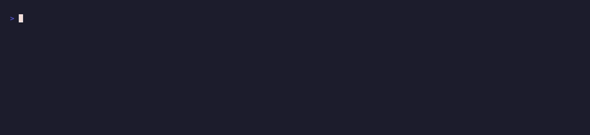

# 🏢 Company Dossier



One domain in, a one-page company brief out.

Company Dossier orchestrates two paid [pay.sh](https://pay.sh) calls for a company:
firmographic enrichment (what they do, size, location) and a recent-news search.
Then `pay claude` writes a plain-English brief a salesperson or partner could use.
Paid per request in USDC, no API keys.

The web/data sibling of [Token Dossier](../token-dossier): one question, a couple
of paid sources, one answer. A failure in any single source degrades gracefully
instead of aborting.

Deliver via stdout (default), Telegram, a webhook, or a websocket.

📎 **X thread:** _(link coming soon)_

---

## What it does

1. Enriches `DOMAIN` via pay.sh (name, industry, headcount, location).
2. Searches pay.sh for recent news about the company.
3. Sends both to `pay claude` for a one-paragraph synthesis.
4. Prints or delivers the brief. The raw sources ride along in the JSON payload.

## Try it instantly (no setup)

```bash
DRY_RUN=1 ./company-dossier.sh
```

Builds a brief from the canned [`example-company.json`](./example-company.json):

```
🏢 Company Dossier: Acme Payments (acmepay.example)
Payments · ~8000 employees · San Francisco, US

Acme Payments is a payment processor for internet businesses, leaning hard into
stablecoins... positioning as core infrastructure for agent and onchain commerce,
not just cards.

Recent:
  • Acme Payments expands stablecoin payouts to 100+ countries (news.example.com)
  • Acme Payments raises a new funding round (press.example.com)
```

No `pay`, no network.

## How to run

```bash
DOMAIN=acme.com ./company-dossier.sh
# or pass it as an argument:
./company-dossier.sh acme.com
```

Non-stdout sinks emit a JSON payload with enrichment + news, for agents:

```json
{"type":"company_dossier","domain":"acmepay.example","name":"Acme Payments","synthesis":"…",
 "enrichment":{…},"news":[{"title":"…","url":"…"}],"text":"🏢 …"}
```

## End-to-end example

```bash
./example.sh          # demo mode (builds from the fixture)
LIVE=1 ./example.sh   # real: needs a funded pay CLI + a valid .env
```

## Prerequisites

- **pay CLI**, installed and funded — <https://pay.sh>.
- **jq**, **curl** — JSON handling and HTTP.

## Environment variables

| Variable | Description |
|---|---|
| `DOMAIN` | Company domain to research (or pass as the first argument) |
| `ALERT_SINK` | `stdout` (default), `telegram`, `webhook`, or `websocket` |
| `TELEGRAM_BOT_TOKEN` / `TELEGRAM_CHAT_ID` | For the `telegram` sink |
| `WEBHOOK_URL` | For the `webhook` sink |
| `WS_URL` | For the `websocket` sink |
| `PAYSH_ENRICH_URL` | _(optional)_ Override the pay.sh enrichment endpoint |
| `PAYSH_SEARCH_URL` | _(optional)_ Override the pay.sh news-search endpoint |

> **Handy for:** prepping a sales call, vetting a partner or vendor, or feeding a
> BD agent structured company context before it drafts outreach.
