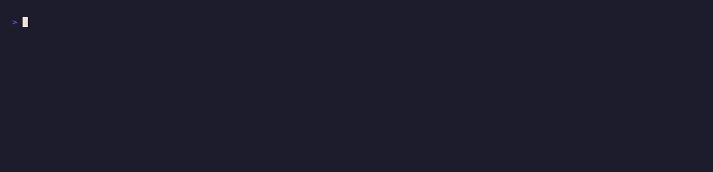

# 🔍 Contract Auditor



Audit a smart contract and get a plain-English risk brief.

Give it a contract address and it pulls a security analysis through
[pay.sh](https://pay.sh) (paid per request in USDC, no API keys), then runs the
findings through `pay claude` to explain the risk in a sentence or two. Address
in, brief out. Good before you ape into a token, or wired into a bot that audits
contracts on request.

Deliver via stdout (default), Telegram, a webhook, or a websocket.

📎 **X thread:** _(link coming soon)_

---

## What it does

1. Fetches a security analysis for `ADDRESS` on `CHAIN` via pay.sh.
2. Reads the risk level and flags (mintable, pausable, upgradeable, blacklist, …).
3. With `SUMMARIZE=1` (default), runs the findings through `pay claude` for a
   plain-English "here's what's risky" summary.
4. Prints or delivers the brief. The raw findings ride along in the JSON payload.

The AI step is the point: a list of flags like `owner_can_blacklist` means little
at a glance, but "the owner can freeze your tokens at any time" lands immediately.

## Try it instantly (no setup)

```bash
DRY_RUN=1 ./contract-auditor.sh
```

Audits the canned [`example-audit.json`](./example-audit.json) and prints:

```
🔍 Contract audit: 0x1111…1111 on ethereum
Risk: HIGH
The owner can still mint new supply and freeze (blacklist) individual holders,
and ownership has not been renounced. That lets the deployer dilute or trap
holders at any time, so treat this contract as high risk.
Flags: mintable, pausable, owner_can_blacklist, ownership_not_renounced
```

No `pay`, no network. Skip the AI brief with `SUMMARIZE=0` for just the flags.

## How to run

```bash
ADDRESS=0xTOKEN... ./contract-auditor.sh
# or pass it as an argument:
./contract-auditor.sh 0xTOKEN...
# on another chain:
CHAIN=base ./contract-auditor.sh 0xTOKEN...
```

Non-stdout sinks emit a JSON payload for agents:

```json
{"type":"contract_audit","address":"0x…","chain":"ethereum","risk":"HIGH",
 "summary":"The owner can still mint …","findings":{…},"text":"🔍 Contract audit: …"}
```

## End-to-end example

```bash
./example.sh          # demo mode (audits the fixture)
LIVE=1 ./example.sh   # real: needs a funded pay CLI + a valid .env
```

## Prerequisites

- **pay CLI**, installed and funded — <https://pay.sh>.
- **jq**, **curl** — JSON handling and HTTP.

## Environment variables

| Variable | Description |
|---|---|
| `ADDRESS` | Contract address to audit (or pass as the first argument) |
| `CHAIN` | Network the contract is on (default `ethereum`) |
| `SUMMARIZE` | `1` (default) for a pay claude brief, `0` for flags only |
| `ALERT_SINK` | `stdout` (default), `telegram`, `webhook`, or `websocket` |
| `TELEGRAM_BOT_TOKEN` / `TELEGRAM_CHAT_ID` | For the `telegram` sink |
| `WEBHOOK_URL` | For the `webhook` sink |
| `WS_URL` | For the `websocket` sink |
| `PAYSH_AUDIT_URL` | _(optional)_ Override the pay.sh audit endpoint |

> **Not financial advice:** the audit reflects whatever the upstream analysis
> catches. Absence of flags is not a guarantee a contract is safe.
