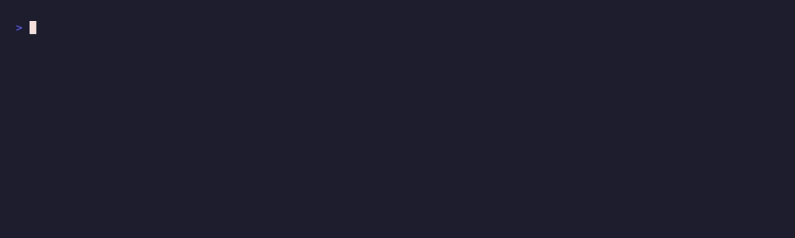

# 🖼️ NFT Floor Watcher



Watch a Solana NFT collection's floor and get pinged when it crosses your line.

NFT Floor Watcher checks a collection's floor price via a paid [pay.sh](https://pay.sh)
call and alerts when it drops below your buy line or rises above your sell line.
Paid per request in USDC on Solana, no API keys.

It fires only on a crossing, not on every check, so a collection sitting under your
buy line won't spam you every minute. It remembers the last floor it saw per
collection and alerts once when the line is crossed.

Deliver via stdout (default), Telegram, a webhook, or a websocket.

📎 **X thread:** _(link coming soon)_

---

## What it does

1. Fetches the collection's floor via pay.sh (`FLOOR` snapshot: price, listings).
2. Compares it to your `FLOOR_BELOW_SOL` (buy) and/or `FLOOR_ABOVE_SOL` (sell) lines.
3. On a fresh crossing, delivers an alert. In range, it stays quiet.
4. Remembers the floor so the next crossing (not every check) is what alerts you.

## Try it instantly (no setup)

```bash
DRY_RUN=1 ./example.sh
```

Evaluates the canned [`example-floor.json`](./example-floor.json) against a 13 SOL buy line:

```
🖼️ NFT Floor Watcher: Sol Otters
Floor 12.4 SOL (was 15.1, -18%)  •  842 listed
⤵️ Dropped below your 13 SOL buy line.
```

No `pay`, nothing spent.

## How to run

```bash
COLLECTION=sol_otters FLOOR_BELOW_SOL=13 ./nft-floor-watcher.sh
# a sell line, or both:
COLLECTION=sol_otters FLOOR_ABOVE_SOL=25 ./nft-floor-watcher.sh
```

Cron it every few minutes and it only speaks up when the floor actually crosses.
Non-stdout sinks emit a JSON payload, so an agent can act on it:

```json
{"type":"nft_floor","collection":"sol_otters","name":"Sol Otters","floor_sol":12.4,
 "prev_floor_sol":15.1,"listed":842,"alert":"below","text":"🖼️ …"}
```

## End-to-end example

```bash
./example.sh                              # demo (fixture vs a 13 SOL buy line)
LIVE=1 COLLECTION=sol_otters FLOOR_BELOW_SOL=13 ./example.sh   # real
```

## Prerequisites

- **pay CLI**, installed and funded — <https://pay.sh>.
- **jq**, **awk**, **curl** — JSON, math, HTTP.

## Environment variables

| Variable | Description |
|---|---|
| `COLLECTION` | Collection slug/symbol to watch (or pass as the first argument) |
| `FLOOR_BELOW_SOL` | Alert when the floor is at or below this (buy line) |
| `FLOOR_ABOVE_SOL` | Alert when the floor is at or above this (sell line) |
| `ALERT_SINK` | `stdout` (default), `telegram`, `webhook`, or `websocket` |
| `TELEGRAM_BOT_TOKEN` / `TELEGRAM_CHAT_ID` | For the `telegram` sink |
| `WEBHOOK_URL` | For the `webhook` sink |
| `WS_URL` | For the `websocket` sink |
| `STATE_DIR` | Where the last-seen floor is remembered (default `~/.nft-floor-watcher`) |
| `PAYSH_NFT_URL` | _(optional)_ Override the pay.sh floor endpoint |

> **Set at least one line.** With only `FLOOR_BELOW_SOL` it watches for dips to buy;
> with only `FLOOR_ABOVE_SOL` it watches for pops to sell; with both it brackets a
> position. Use `STATE_DIR` (or separate dirs) to watch several collections at once.
