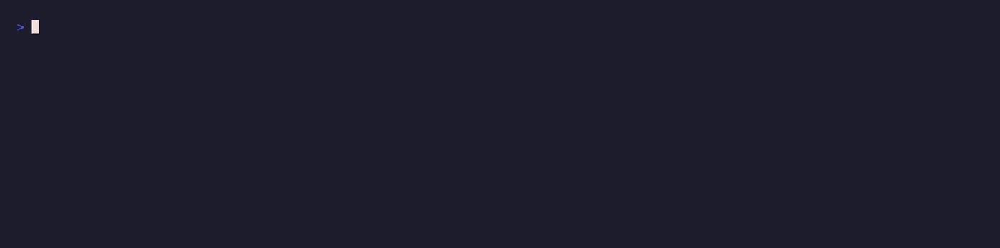

# 🗂️ Token Dossier



One token address in, a full due-diligence brief out.

Token Dossier orchestrates several paid [pay.sh](https://pay.sh) calls for one
address and synthesizes them into a single verdict: contract risk (audit), price
and 24h move (market data), recent large flows (on-chain), and social sentiment.
Then `pay claude` writes a one-paragraph "should you be careful with this" brief.
Paid per request in USDC, no API keys.

This is the orchestration recipe: one question, many paid sources, one answer. A
failure in any single source degrades gracefully instead of aborting.

Deliver via stdout (default), Telegram, a webhook, or a websocket.

📎 **X thread:** _(link coming soon)_

---

## What it does

1. Fires four pay.sh lookups for the address: audit, market, on-chain, social.
2. Anchors a verdict on the contract risk (AVOID / CAUTION / LOOKS OK).
3. Sends all four sources to `pay claude` for a plain-English synthesis.
4. Prints or delivers the dossier. The raw sources ride along in the JSON payload.

It is the multi-source research pattern in one script: a handful of small paid
calls, settled per request, composed into a single decision an agent (or you) can
act on.

## Try it instantly (no setup)

```bash
DRY_RUN=1 ./token-dossier.sh
```

Builds a dossier from the canned [`example-dossier.json`](./example-dossier.json):

```
🗂️ Token Dossier: MEME on ethereum
Verdict: AVOID

This token carries serious contract risk: the owner can still mint supply and
blacklist holders, and ownership is not renounced. Price is down 8% on the day
with several large outflows, and the top holder controls 41% of supply. Social
chatter is mixed. Treat it as high risk and size accordingly, if at all.

• Contract: HIGH (mintable, owner_can_blacklist, ownership_not_renounced)
• Price: $0.01234 (-8.2% 24h)
• Flows: 3 large outflows totaling ~$1.2M in the last 24h
• Sentiment: mixed (12 mentions)
```

No `pay`, no network.

## How to run

```bash
ADDRESS=0xTOKEN... ./token-dossier.sh
# or pass it as an argument:
./token-dossier.sh 0xTOKEN...
# on another chain:
CHAIN=base ./token-dossier.sh 0xTOKEN...
```

Non-stdout sinks emit a JSON payload with all four sources, for agents:

```json
{"type":"token_dossier","address":"0x…","chain":"ethereum","symbol":"MEME",
 "verdict":"AVOID","synthesis":"…","sources":{"audit":{…},"market":{…},
 "onchain":{…},"social":{…}},"text":"🗂️ Token Dossier: …"}
```

## End-to-end example

```bash
./example.sh          # demo mode (builds from the fixture)
LIVE=1 ./example.sh   # real: needs a funded pay CLI + a valid .env
```

## Prerequisites

- **pay CLI**, installed and funded — <https://pay.sh>.
- **jq**, **curl** — JSON handling and HTTP.

## Environment variables

| Variable | Description |
|---|---|
| `ADDRESS` | Token contract address (or pass as the first argument) |
| `CHAIN` | Network the token is on (default `ethereum`) |
| `SYMBOL` | _(optional)_ Ticker for display; otherwise taken from market data |
| `ALERT_SINK` | `stdout` (default), `telegram`, `webhook`, or `websocket` |
| `TELEGRAM_BOT_TOKEN` / `TELEGRAM_CHAT_ID` | For the `telegram` sink |
| `WEBHOOK_URL` | For the `webhook` sink |
| `WS_URL` | For the `websocket` sink |
| `PAYSH_AUDIT_URL` / `PAYSH_MARKET_URL` / `PAYSH_ONCHAIN_URL` / `PAYSH_SOCIAL_URL` | _(optional)_ Override any endpoint whose route differs |

> **Not financial advice:** the dossier is only as good as its sources, and a
> clean verdict is not a guarantee. It is a starting point, not a decision.
